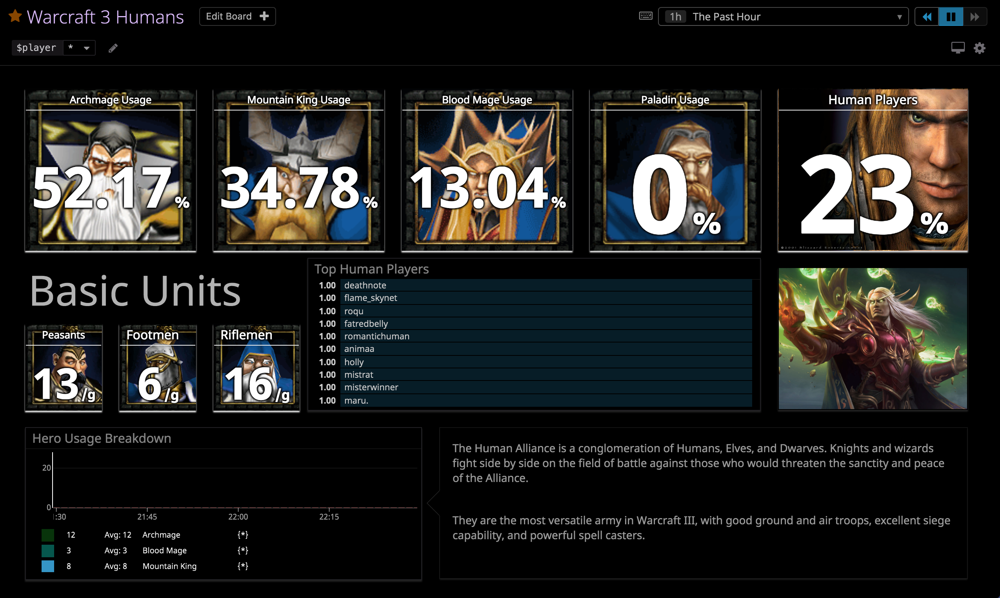

## Warcraft 3 Replay Analysis

Deployed on Heroku at https://war3-hackday.herokuapp.com/

## What is it? 
As part of my hackday, I created 5 Datadog screenboards for Warcraft 3 Replay Analysis 1v1 Pro Ladder games.  
I downloaded my replay packs from https://warcraft3.info/replays and saved them locally into a folder inside my app.

## Application
All of my code is located in the `app/` folder of the repository.   
I used https://brettlangdon.github.io/node-dogapi/ to gather my metrics.  

These 2 articles helped me in the process:  
- [How to change the colors of my dashboards? Reverse Color Scheme - Martin Fejoz](https://help.datadoghq.com/hc/en-us/articles/203345119-How-to-change-the-colors-of-my-dashboards-Reverse-Color-Scheme)  
- [How do I exclude certain tags from a graph or monitor? - Samantha Drago](https://help.datadoghq.com/hc/en-us/articles/204520129-How-do-I-exclude-certain-tags-from-a-graph-or-monitor-)

## Flow
[Saved Replays Locally](https://warcraft3.info/replays)   
--> [w3g package returns JSON data](https://www.npmjs.com/package/w3g)   
--> [Parser to include only Metrics I need](app/parser.js) + [Parse by Race](app/raceParser.js)  
--> [Submit metrics](app/index.js)  
--> [Serve to Heroku](app/server.js)

## Dependencies

- DogAPI v2.8.3 --> Send Metrics to Datadog from my Node app
- dotenv v6.1.0 --> Hide my Application/API keys
- express v4.16.4 --> Run my server onto Heroku
- nodemon v1.18.4 --> Automatically restart server whenever there are changes in my code
- pug v2.0.3 --> Front end HTML template
- w3g v1.0.3 --> w3g replay parser

## JSON Items Parsed and sent as Metrics
I then parsed the replay into JSON objects that I needed including
  - Heroes
  - Actions per Minute (APM)
  - Race
  - Units
  - Game Length

Missing Categories that I would have liked
  - Resources, such as Gold and Wood
  - Win/Loss

List of metrics sent:

```
war3.apm
war3.gameLength
war3.total_games
war3.rdm
war3.hu
war3.hu.peasant
war3.hu.footman
war3.hu.rifleman
war3.hero.am
war3.hero.bm
war3.hero.mk
war3.hero.pl
war3.orc
war3.orc.peon
war3.orc.grunt
war3.orc.raider
war3.hero.fs
war3.hero.bm
war3.hero.sh
war3.hero.tc
war3.ud
war3.ud.acolyte
war3.ud.ghoul
war3.ud.fiend
war3.hero.dk
war3.hero.lich
war3.hero.cl
war3.hero.dl
war3.ne
war3.ne.wisp
war3.ne.archer
war3.ne.huntress
war3.ne.hero.dh
war3.ne.hero.kotg
war3.ne.hero.potm
war3.ne.hero.wd
```

## Tags
I then tagged each individual replay with a player-name. Example `player:ben`.  
In this way, in my screenboards I could create Template Variables to see the stats of each player.

## Moving Forward
- Save replays into a database instead of saving it locally
- Add a section for **Hero Abilities + Levels + Items, Resources (Gold + Wood), Advanced Units**

## Bugs
1) When I downloaded replay packs, certain replays consistently returned this error:
```
replay /Users/ben.basuni/Desktop/war3-hackday/replays/000.w3g
/Users/ben.basuni/Desktop/war3-hackday/app/parser.js:21
  let getValOf = v => v[Object.keys(v)[0]];
                               ^
TypeError: Cannot convert undefined or null to object
```

I didn't spend too much time debugging this, but if I were to guess, I think the error occurs whenever there is no one spectating. Usually in pro games, they almost always play with a moderator or someone spectating. I'm guessing that in the case where there are no moderators, this errors out.

2) APM & players are returning only once. As you can see in the **Overview** Board - **Top 10 APM** Graph & **Race** Board - **Top 10 Players** Graph, all the APMs are precise numbers (ending with .00). This isn't taking into account 2 or 3 replays, since there is a very minimal chance that these players consistently hit the same (ex: 350 APM) every single game.

Troubleshooting how I am submitting these metrics is the way to go from here.

## Pictures of my Screenboard & Deployed Heroku App
[Overview Screenboard](https://p.datadoghq.com/sb/1727bc129-8ccfbfffa5514bab1bb14a9efc5f1f37)  


[Human Screenboard](https://p.datadoghq.com/sb/1727bc129-bd5d0e942cb9c5b50ae25799cbb533fd)



[Orc Screenboard](https://p.datadoghq.com/sb/1727bc129-d872d03e25757e6d16c25df8be77de38)


[Night Elf Screenboard](https://p.datadoghq.com/sb/1727bc129-b388ec08c2835fbc6b897192e394be1f)


[Undead Screenboard](https://p.datadoghq.com/sb/1727bc129-b1e02805e86a3e4ffbd930a03a19b5b7)


Hackday time! 
- [x] Readme Edit with Pictures
- [ ] Create Trello Card
- [x] Deploy to Heroku
- [x] Add /post in API to run `node index.js`
